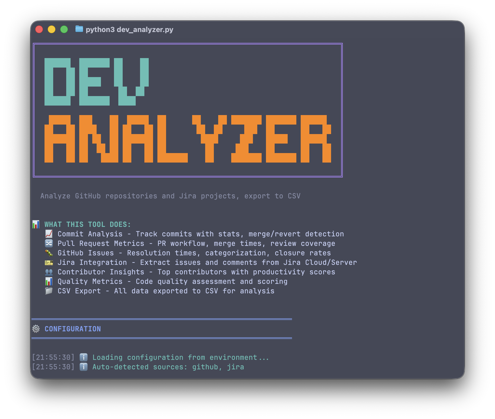
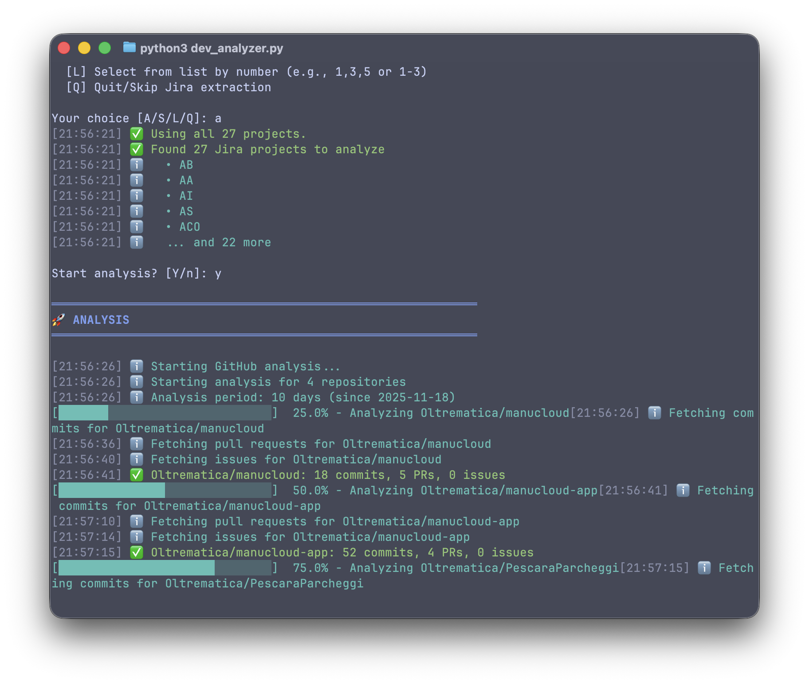
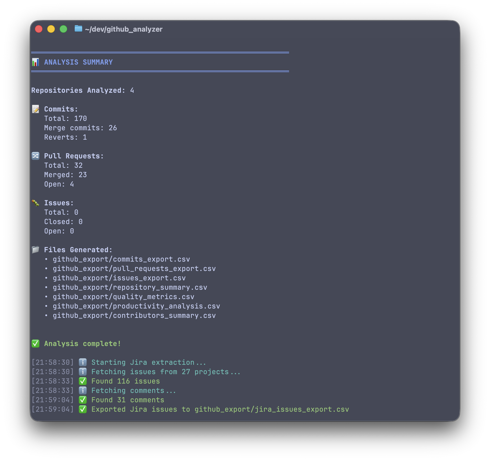

# GitHub Analyzer

[](https://github.com/Oltrematica/github_analyzer/actions/workflows/tests.yml)
[](https://github.com/Oltrematica/github_analyzer/actions/workflows/tests.yml)
[](https://codecov.io/gh/Oltrematica/github_analyzer)
[](https://www.python.org/downloads/)
[](https://opensource.org/licenses/MIT)

A powerful Python command-line tool for analyzing GitHub repositories and extracting comprehensive metrics about commits, pull requests, issues, and contributor activity. Generate detailed CSV reports for productivity analysis and code quality assessment.



## Features

- **Commit Analysis** - Track commits with detailed statistics including additions, deletions, merge detection, and revert identification
- **Pull Request Metrics** - Monitor PR workflow, merge times, review coverage, and approval rates
- **Issue Tracking** - Analyze issue resolution times, categorization (bugs vs enhancements), and closure rates
- **Contributor Insights** - Identify top contributors with activity metrics and productivity scoring
- **Multi-Repository Support** - Analyze multiple repositories in a single run with aggregated statistics
- **Quality Metrics** - Assess code quality through revert ratios, review coverage, and commit message analysis
- **Productivity Scoring** - Calculate composite productivity scores for contributors across repositories
- **Zero Dependencies** - Works with Python standard library only (optional `requests` for better performance)
- **Secure Token Handling** - Token loaded from environment variable, never exposed in logs or error messages

## Requirements

- **Python 3.9+**
- **GitHub Personal Access Token** with `repo` scope

## Installation

```bash
# Clone or download the project
git clone <repository-url>
cd github_analyzer

# (Optional) Install development dependencies
pip install -r requirements-dev.txt

# (Optional) Install requests for better performance
pip install requests
```

No additional packages are required. The tool uses Python's standard library and falls back gracefully if `requests` is not installed.

## Quick Start

### 1. Get a GitHub Token

- Go to [GitHub Settings > Developer settings > Personal access tokens](https://github.com/settings/tokens)
- Generate a new token with `repo` scope
- Copy the token

### 2. Set the Token

```bash
export GITHUB_TOKEN=ghp_your_token_here
```

### 3. Create repos.txt

```bash
echo "facebook/react" > repos.txt
echo "microsoft/vscode" >> repos.txt
```

### 4. Run the Analyzer

```bash
# Analyze last 30 days (default)
python3 github_analyzer.py

# Analyze last 7 days
python3 github_analyzer.py --days 7

# Short form
python3 github_analyzer.py -d 7
```

### 5. View Results

CSV files are generated in the `github_export/` directory.

## Command Line Options

```
usage: github_analyzer.py [-h] [--days DAYS] [--output OUTPUT] [--repos REPOS] [--quiet]

Analyze GitHub repositories and export metrics to CSV.

optional arguments:
  -h, --help            show this help message and exit
  --days DAYS, -d DAYS  Number of days to analyze (default: 30)
  --output OUTPUT, -o OUTPUT
                        Output directory for CSV files (default: github_export)
  --repos REPOS, -r REPOS
                        Path to repos.txt file (default: repos.txt)
  --quiet, -q           Suppress verbose output
```

### Examples

```bash
# Analyze last 7 days
python3 github_analyzer.py --days 7

# Analyze with custom output directory
python3 github_analyzer.py -d 14 -o ./reports

# Use different repos file
python3 github_analyzer.py -r my_repos.txt -d 30

# Quiet mode (minimal output)
python3 github_analyzer.py -d 7 -q
```

### Analysis in Progress

The tool shows real-time progress with detailed information for each repository:



## Configuration

### Environment Variables

| Variable | Required | Default | Description |
|----------|----------|---------|-------------|
| `GITHUB_TOKEN` | **Yes** | - | GitHub Personal Access Token |
| `GITHUB_ANALYZER_DAYS` | No | 30 | Number of days to analyze |
| `GITHUB_ANALYZER_OUTPUT_DIR` | No | `github_export` | Output directory for CSV files |
| `GITHUB_ANALYZER_REPOS_FILE` | No | `repos.txt` | Repository list file |
| `GITHUB_ANALYZER_VERBOSE` | No | `true` | Enable detailed logging |

**Note:** CLI arguments override environment variables.

### repos.txt Format

```txt
# Add repositories to analyze (one per line)
# Format: owner/repo or full GitHub URL

facebook/react
microsoft/vscode
https://github.com/kubernetes/kubernetes
astral-sh/ruff

# Lines starting with # are comments
# Empty lines are ignored
# Duplicates are automatically removed
```

## Output Files

The analyzer generates 7 CSV files in the output directory:



| File | Description |
|------|-------------|
| `commits_export.csv` | All commits with author, date, changes, merge/revert status |
| `pull_requests_export.csv` | PRs with state, merge status, review metrics, time-to-merge |
| `issues_export.csv` | Issues with state, labels, assignees, time-to-close |
| `repository_summary.csv` | Per-repository aggregate statistics |
| `quality_metrics.csv` | Code quality scores and metrics per repository |
| `productivity_analysis.csv` | Per-contributor productivity metrics and scores |
| `contributors_summary.csv` | Contributor overview with commit and PR statistics |

### CSV Field Details

#### commits_export.csv
```
repository, sha, short_sha, author_login, author_email, committer_login,
date, message, additions, deletions, total_changes, files_changed,
is_merge_commit, is_revert, file_types, url
```

#### pull_requests_export.csv
```
repository, number, title, state, author_login, created_at, updated_at,
closed_at, merged_at, is_merged, is_draft, time_to_merge_hours,
reviewers_count, approvals, changes_requested, url
```

#### issues_export.csv
```
repository, number, title, state, author_login, created_at, closed_at,
labels, assignees, comments_count, time_to_close_hours, is_bug,
is_enhancement, url
```

#### quality_metrics.csv
```
repository, revert_ratio_pct, avg_commit_size, large_commits_pct,
pr_review_coverage_pct, approval_rate_pct, change_request_rate_pct,
draft_prs_pct, conventional_commits_pct, quality_score
```

#### productivity_analysis.csv
```
contributor, repositories_count, total_commits, total_additions,
total_deletions, prs_opened, prs_merged, prs_reviewed, merge_rate_pct,
first_activity, last_activity, active_days, consistency_pct,
productivity_score
```

## Quality Metrics Explained

The analyzer calculates several quality indicators:

| Metric | Description | Ideal |
|--------|-------------|-------|
| **Revert Ratio** | Percentage of commits that are reverts | < 5% |
| **Avg Commit Size** | Average lines changed per commit | 50-200 |
| **Large Commits** | Commits with >500 lines changed | < 10% |
| **Review Coverage** | PRs that received at least one review | > 80% |
| **Approval Rate** | PRs approved before merge | > 90% |
| **Conventional Commits** | Commits following conventional format | > 50% |
| **Quality Score** | Weighted composite score (0-100) | > 70 |

## Productivity Scoring

Contributor productivity is measured by:

- **Total Commits** - Number of commits across analyzed repositories
- **PRs Merged** - Successfully merged pull requests
- **Merge Rate** - Percentage of opened PRs that got merged
- **Active Days** - Days with at least one contribution
- **Consistency** - Regularity of contributions over the period
- **Productivity Score** - Weighted composite score

## Project Structure

```
github_analyzer/
├── github_analyzer.py          # Backward-compatible entry point
├── repos.txt                   # Repository configuration file
├── requirements.txt            # Optional dependencies (requests)
├── requirements-dev.txt        # Development dependencies (pytest, ruff)
├── pyproject.toml              # Project configuration
├── pytest.ini                  # Test configuration
├── src/
│   └── github_analyzer/        # Main package
│       ├── __init__.py         # Package exports
│       ├── api/                # GitHub API client
│       │   ├── client.py       # HTTP client with retry logic
│       │   └── models.py       # Data models (Commit, PR, Issue, etc.)
│       ├── analyzers/          # Data analysis logic
│       │   ├── commits.py      # Commit analysis
│       │   ├── pull_requests.py# PR analysis
│       │   ├── issues.py       # Issue analysis
│       │   ├── quality.py      # Quality metrics calculation
│       │   └── productivity.py # Contributor tracking
│       ├── exporters/          # CSV export functionality
│       │   └── csv_exporter.py # Export to CSV files
│       ├── cli/                # Command-line interface
│       │   ├── main.py         # Entry point and orchestrator
│       │   └── output.py       # Terminal formatting
│       ├── config/             # Configuration management
│       │   ├── settings.py     # AnalyzerConfig dataclass
│       │   └── validation.py   # Repository validation
│       └── core/               # Shared utilities
│           └── exceptions.py   # Custom exception hierarchy
├── tests/                      # Test suite
│   ├── unit/                   # Unit tests
│   │   └── config/             # Config tests
│   ├── integration/            # Integration tests
│   └── fixtures/               # Test fixtures
└── github_export/              # Output directory for CSV files
```

## API Rate Limits

The tool monitors GitHub API rate limits:
- **Authenticated requests**: 5,000 per hour
- **Pagination**: Up to 50 pages per endpoint
- **Timeout**: 30 seconds per request
- **Retry**: Exponential backoff for transient failures

Rate limit status is tracked automatically.

## Error Handling

The analyzer gracefully handles:
- Missing or invalid GitHub tokens
- Rate limit exceeded (HTTP 403)
- Repository not found (HTTP 404)
- Network timeouts
- Malformed repository URLs
- Empty repository lists
- Invalid input with dangerous characters (injection protection)

## Testing

```bash
# Install dev dependencies
pip install -r requirements-dev.txt

# Run all tests
pytest

# Run with coverage
pytest --cov=src/github_analyzer

# Run linter
ruff check src/github_analyzer/
```

## Use Cases

1. **Team Performance Reviews** - Generate productivity reports for sprint retrospectives
2. **Code Quality Audits** - Assess review practices and commit quality across repositories
3. **Open Source Analysis** - Analyze contributor patterns in open source projects
4. **Repository Health Checks** - Monitor issue resolution and PR merge velocity
5. **Trend Analysis** - Compare metrics over different time periods
6. **Multi-Team Reporting** - Aggregate metrics across organizational repositories

## Troubleshooting

### "GITHUB_TOKEN environment variable not set"
```bash
export GITHUB_TOKEN=ghp_your_token_here
```

### "Token validation failed"
- Ensure your token has `repo` scope
- Check if the token has expired
- Token must start with `ghp_`, `github_pat_`, `gho_`, or `ghs_`

### "Repository not found"
- Check the repository name format: `owner/repo`
- Verify you have access to private repositories with your token
- Ensure the repository exists

### "Rate limit exceeded"
- Wait for the rate limit to reset (usually 1 hour)
- Reduce the number of repositories analyzed at once
- Use a shorter analysis period with `--days`

### Empty CSV files
- Check if repositories have activity in the specified period
- Verify repository names in `repos.txt` are correct
- Ensure the token has read access to the repositories

## Security

- **Token Security**: The GitHub token is loaded from the `GITHUB_TOKEN` environment variable and is never stored, logged, or exposed in error messages
- **Input Validation**: Repository names are validated against injection attacks (shell metacharacters, path traversal)
- **No External Dependencies**: Core functionality works with Python standard library only

## Contributing

Contributions are welcome! Please follow these guidelines:

### Getting Started

1. **Fork the repository** on GitHub
2. **Clone your fork** locally:
   ```bash
   git clone https://github.com/YOUR_USERNAME/github_analyzer.git
   cd github_analyzer
   ```
3. **Create a feature branch**:
   ```bash
   git checkout -b feat/your-feature-name
   ```
4. **Install development dependencies**:
   ```bash
   pip install -r requirements-dev.txt
   ```

### Development Workflow

1. **Make your changes** following the code style guidelines
2. **Run the linter** before committing:
   ```bash
   ruff check src/github_analyzer/
   ```
3. **Run tests** and ensure they pass:
   ```bash
   pytest tests/ -v
   ```
4. **Check coverage** - we aim for **≥95% test coverage**:
   ```bash
   pytest --cov=src/github_analyzer --cov-report=term-missing
   ```

### Code Style

- **Python 3.9+** compatibility required
- Use **type hints** for all function signatures
- Follow **PEP 8** conventions (enforced by ruff)
- Keep functions focused and small
- Add docstrings for public functions and classes

### Commit Message Format

We use **Conventional Commits** format:

```
<type>(<scope>): <description>

[optional body]

[optional footer]
```

**Types:**
- `feat`: New feature
- `fix`: Bug fix
- `docs`: Documentation changes
- `style`: Code style changes (formatting, no logic change)
- `refactor`: Code refactoring
- `perf`: Performance improvements
- `test`: Adding or updating tests
- `build`: Build system or dependencies
- `ci`: CI/CD configuration
- `chore`: Maintenance tasks

**Examples:**
```bash
feat(api): add retry logic for rate-limited requests
fix(cli): handle empty repository list gracefully
docs(readme): add troubleshooting section
test(analyzers): add unit tests for quality metrics
```

### Pull Request Guidelines

1. **Update tests** for any new functionality
2. **Maintain or improve coverage** (minimum 95%)
3. **Update documentation** if adding new features
4. **Keep PRs focused** - one feature/fix per PR
5. **Reference issues** if applicable: `Fixes #123`

### Testing Requirements

- All new code must have corresponding unit tests
- Tests should be in `tests/unit/` following the source structure
- Use `pytest` fixtures for test data
- Mock external dependencies (GitHub API, file system)

### Documentation

- Update README.md for user-facing changes
- Add docstrings to new public APIs
- Keep examples up to date

### Questions?

Open an issue for discussion before starting major changes.

## License

This project is provided as-is for educational and analytical purposes.

## Acknowledgments

- Built using the [GitHub REST API v3](https://docs.github.com/en/rest)
- Designed for cross-platform compatibility with Python standard library
